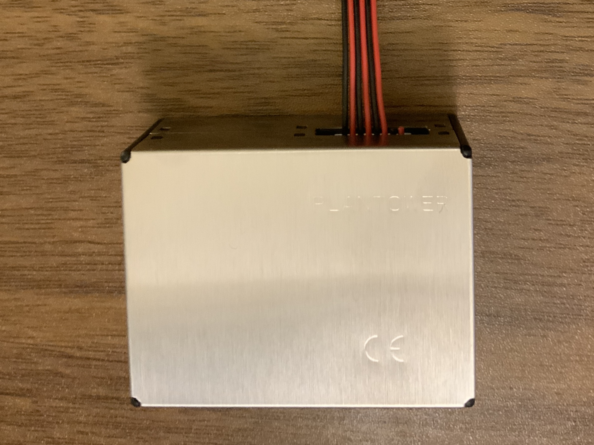

# Plantower

[](https://github.com/tomarrell/plantower/actions/workflows/test.yaml)
[](https://pkg.go.dev/github.com/tomarrell/plantower)

This library allows you to decode data coming from the Plantower PMS5003 Digital
universal particle concentration sensor.

Currently supports models:
- PMS5003 (Active Mode)



## Usage

The library takes an `io.Reader` representing a stream of bytes from the sensor.
This allows you to decide how you read the data from the physical link.

```go
package main

import ()

func main() {
  // TODO
}
```
